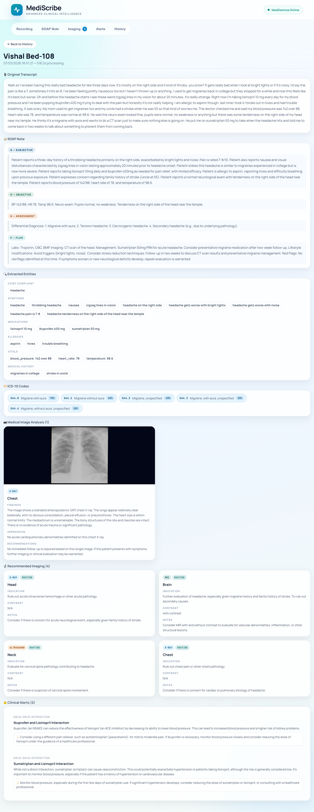
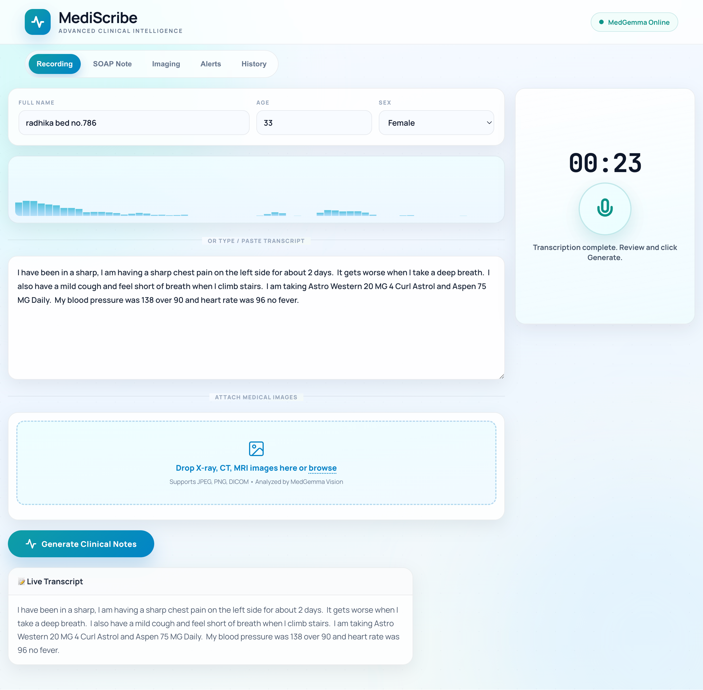
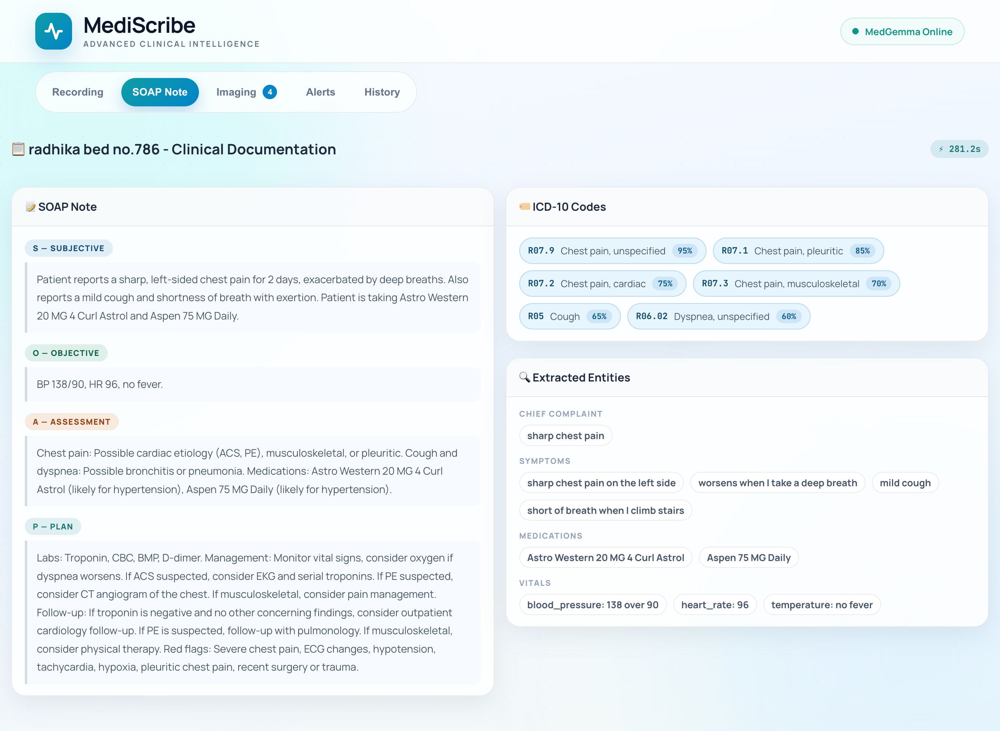
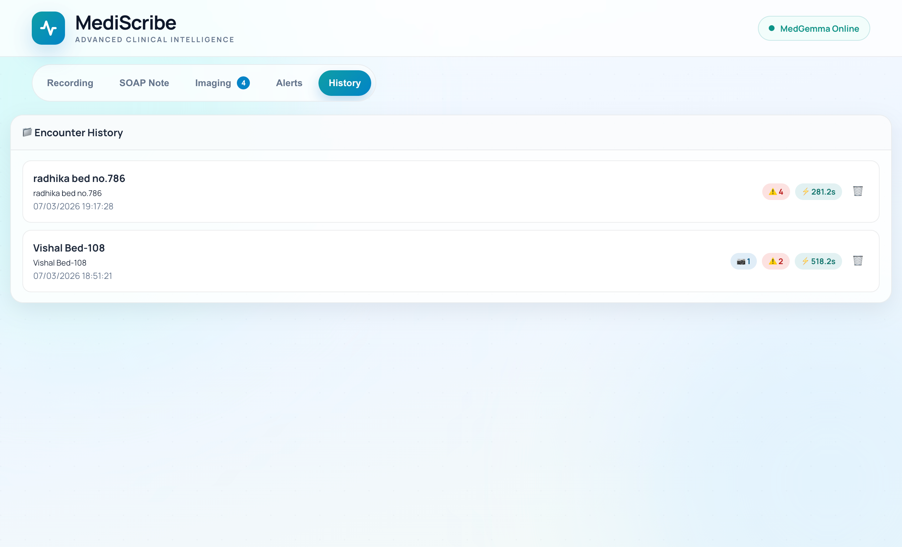
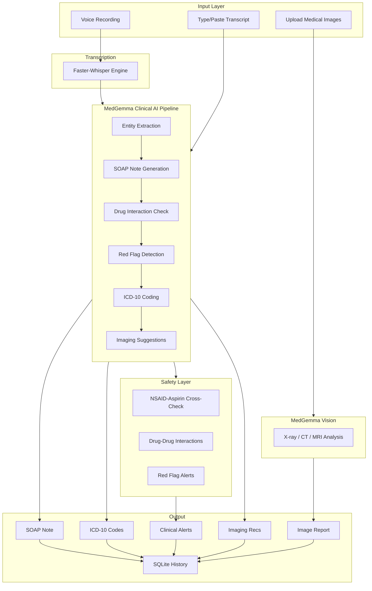
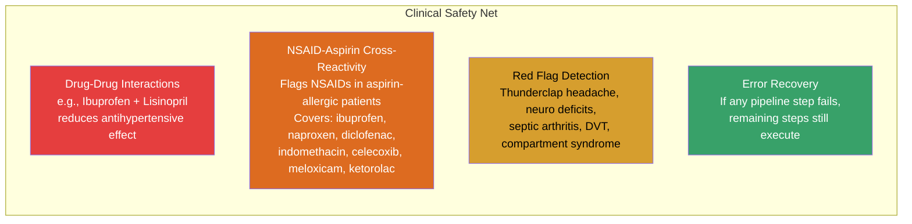

<p align="center">
  
  
  
  
</p>

# MediScribe - AI-Powered Clinical Documentation System

MediScribe transforms spoken clinical notes into structured, actionable medical records - entirely on-device, with no cloud dependency. By converting natural speech into comprehensive documentation, it allows healthcare professionals to focus on patient care rather than administrative tasks.

---

## The Problem

Clinical documentation remains one of the most time-consuming aspects of healthcare delivery. The administrative demands on medical professionals continue to grow, creating friction between documentation requirements and patient care.

| Challenge | Impact |
|---|---|
| Documentation Burden | Physicians spend approximately **2 hours on administrative tasks for every 1 hour of direct patient care**, significantly limiting face-to-face interaction time |
| Shift Handover Gaps | Critical patient information is often lost or misinterpreted during day-to-night shift transitions, potentially affecting continuity of care |
| Manual Note-Taking | Handwritten clinical notes are frequently illegible, incomplete, or inconsistently formatted, making them difficult to reference later |
| Delayed Billing | Manual ICD-10 code assignment extends the revenue cycle, delaying hospital reimbursement and increasing administrative overhead |
| Patient Safety | Time pressures can lead to overlooked drug interactions, missed allergy alerts, and incomplete clinical assessments |

MediScribe addresses these challenges by enabling healthcare providers to simply speak - and let MediScribe handle the rest.

---

## Features

### Voice-First Documentation
- Speak naturally without needing any special format or syntax
- Record directly from any device with a microphone - phone, laptop, or tablet
- Real-time transcription powered by Faster-Whisper
- Alternatively, type or paste a transcript manually

### Automated SOAP Notes
- Generates comprehensive Subjective, Objective, Assessment, and Plan documentation
- Provides structured differentials for each presenting complaint
- Includes evidence-based treatment plans with recommended labs, imaging, medications, and follow-up timelines

### Clinical Entity Extraction
- Automatically identifies chief complaint, symptoms, vitals, medications, allergies, and medical, family, and social history
- Preserves precise anatomical descriptions and laterality information

### ICD-10 Coding
- Provides 3-6 ICD-10-CM code suggestions with confidence scores
- Maps directly from clinical symptoms and assessment to support accurate billing

### Medical Image Analysis (MedGemma Vision)
- Supports direct upload of X-rays, CT scans, and MRI images
- Delivers AI-powered analysis including findings, impressions, abnormalities, and recommendations
- Compatible with JPEG and PNG formats

### Imaging Recommendations
- Suggests appropriate imaging studies including CT, MRI, X-ray, Ultrasound, and PET
- Specifies modality, body region, clinical indication, urgency level, and contrast requirements

### Clinical Safety Alerts
- Detects drug-drug interactions (e.g., Ibuprofen + Lisinopril)
- Includes NSAID-Aspirin cross-reactivity monitoring - automatically flags NSAIDs for patients with aspirin allergies
- Identifies red flag symptoms including thunderclap headache, neurological deficits, and signs of septic arthritis
- Categorized by severity: Critical, Warning, or Info

### Encounter History
All patient encounters are securely stored locally in SQLite, allowing clinicians to browse, review, or delete past encounters while preserving full clinical detail for future reference.

### Privacy-First Architecture
MediScribe operates completely offline - no patient data ever leaves the local machine. The system runs efficiently on consumer-grade NVIDIA GPUs (RTX 4050+) using 4-bit quantization, maintaining HIPAA-ready data sovereignty with a local SQLite database.

---

## Use Cases

### Shift Handovers
When a day shift physician records a patient encounter, MediScribe automatically generates a structured SOAP note. The incoming night shift team can instantly access a comprehensive clinical summary complete with alerts, medications, and pending actions - eliminating the gaps traditionally caused by handwritten notes.

### Bedside Documentation
A nurse at the bedside can simply tap the microphone on their phone and speak naturally about the patient's condition. MediScribe handles transcription and structuring automatically - no clipboard, pen, or laptop required.

### Emergency/OPD Workflow
Following a patient examination, the physician speaks their findings aloud while MediScribe generates a complete note including differentials, recommended labs, imaging studies, and ICD-10 codes - all before the patient leaves the consultation room.

### Medical Image Review
A chest X-ray, CT scan, or MRI can be uploaded directly, where MedGemma Vision analyzes the image and automatically attaches findings and impressions to the patient encounter.

---

## Screenshots

### Main Interface


### Voice Input


### SOAP Notes


### Encounter History


---

## System Architecture



### Clinical Pipeline Flow


---

## Quick Start

### Prerequisites

Before installing MediScribe, ensure your environment meets the following requirements:

- **Python 3.10+**
- **NVIDIA GPU** with CUDA support (RTX 4050 or better recommended)
- **HuggingFace account** with access to [google/medgemma-4b-it](https://huggingface.co/google/medgemma-4b-it)

### Installation

#### Step 1 - Install Dependencies
```bash
python 1stcell.PY
```
> Restart your terminal/Python environment after this step

This step installs PyTorch (CUDA 12.1), Transformers, Faster-Whisper, FastAPI, and all necessary dependencies.

#### Step 2 - Authenticate with HuggingFace
```bash
python 2ndcell.py
```
You can either:
- Set `HF_TOKEN` in a `.env` file in the project root
- Set it as an environment variable: `export HF_TOKEN=hf_your_token_here`
- Or paste it interactively when prompted

#### Step 3 - Launch MediScribe
```bash
python 3finalcell.py
```
This command will load the MedGemma-4B-it clinical AI model, initialize Faster-Whisper for speech recognition, and launch the FastAPI server on port `7860`.

```
============================================================
  OPEN IN BROWSER:  http://127.0.0.1:7860
============================================================
```

### Access from Phone or Other Devices
MediScribe runs on `0.0.0.0:7860`, making it accessible from any device on the same network:
```
http://<your-computer-ip>:7860
```
On Windows, find your IP using `ipconfig`; on Mac/Linux, use `ifconfig`. Opening this URL on a mobile browser provides full functionality, including voice recording capabilities.

---

## Project Structure

```
MediScribe/
├── 1stcell.PY              # Dependency installer
├── 2ndcell.py              # HuggingFace authentication script
├── 3finalcell.py           # Model loader and server launcher
├── medgemma_engine.py      # Core AI engine - 6-stage clinical pipeline with safety checks
├── transcriber.py          # Faster-Whisper transcription engine
├── server.py               # FastAPI server with REST API endpoints
├── models.py               # Pydantic data models (SOAP, Entities, Alerts, etc.)
├── database.py             # SQLite-based encounter storage
├── requirements.txt        # Python dependencies
├── static/
│   ├── index.html          # Clinical user interface
│   ├── app.js              # Frontend logic for recording, rendering, and tabs
│   └── styles.css          # Medical-themed dark interface
├── uploads/                # Uploaded medical images
└── mediscribe.db           # Local encounter database
```

---

## API Reference

| Endpoint | Method | Description |
|---|---|---|
| `/` | GET | Serves the MediScribe web interface |
| `/health` | GET | Server health check including model load status |
| `/api/transcribe` | POST | Transcribes an audio file to text |
| `/api/generate` | POST | Executes the full clinical pipeline on a transcript |
| `/api/full-pipeline` | POST | Processes audio through transcription and clinical pipeline in a single call |
| `/api/analyze-image` | POST | Analyzes a single medical image |
| `/api/encounters` | GET | Retrieves a list of all saved encounters |
| `/api/encounters/{id}` | DELETE | Removes a specific encounter from storage |

---

## Safety Features



The built-in NSAID safety guard evaluates both the generated treatment plan and the patient's current medication list - ensuring that even if a physician does not verbally mention ibuprofen, MediScribe will flag it if the patient is already taking it.

---

## Device Compatibility

| Device | Usage |
|---|---|
| Laptop/Desktop | Run the server and open `localhost:7860` in your browser |
| Mobile Phone | Connect to the same WiFi network and open `http://<server-ip>:7860` in your mobile browser |
| Tablet | Same as mobile - fully responsive interface |
| Hospital Workstation | Run the server on a centralized GPU machine and access from any workstation on the network |

Tip: Bookmark the URL on your mobile device for quick bedside access. The microphone button functions natively in mobile browsers.

---

## Performance

| Component | Specification |
|---|---|
| MedGemma Model | google/medgemma-4b-it (4-bit quantized) |
| Whisper Model | faster-whisper base (upgradeable to small/medium) |
| Full Pipeline | 60-300 seconds per encounter (varies by GPU) |
| Transcription | 5-15 seconds for 1-minute audio |
| Image Analysis | 30-60 seconds per image |
| Minimum GPU | NVIDIA RTX 4050 (6GB VRAM) |
| Recommended GPU | NVIDIA RTX 4070+ (8GB+ VRAM) |

---

## Acknowledgements

MediScribe builds on several open-source projects:

- [MedGemma](https://huggingface.co/google/medgemma-4b-it) by Google - Clinical foundation model
- [Faster-Whisper](https://github.com/SYSTRAN/faster-whisper) - CTranslate2-accelerated speech recognition
- [FastAPI](https://fastapi.tiangolo.com/) - High-performance Python web framework

---

